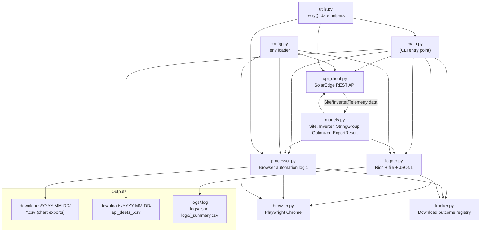
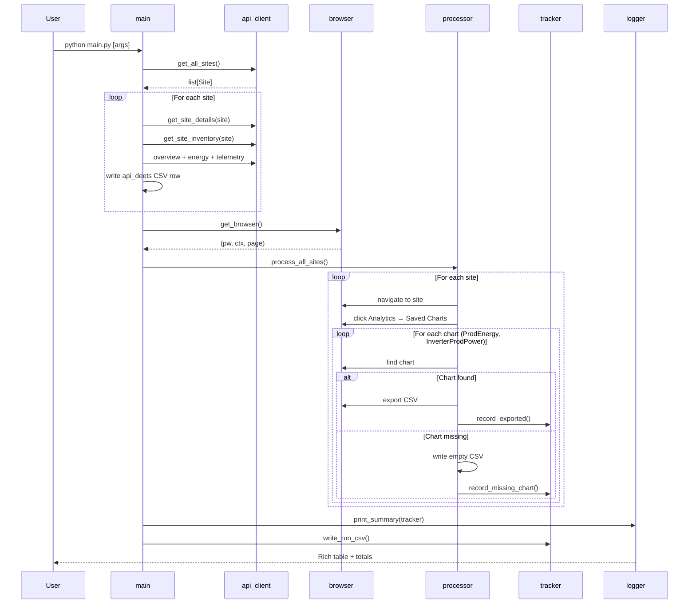
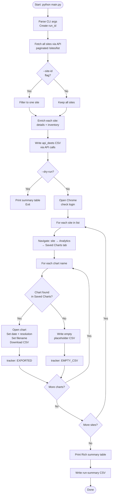
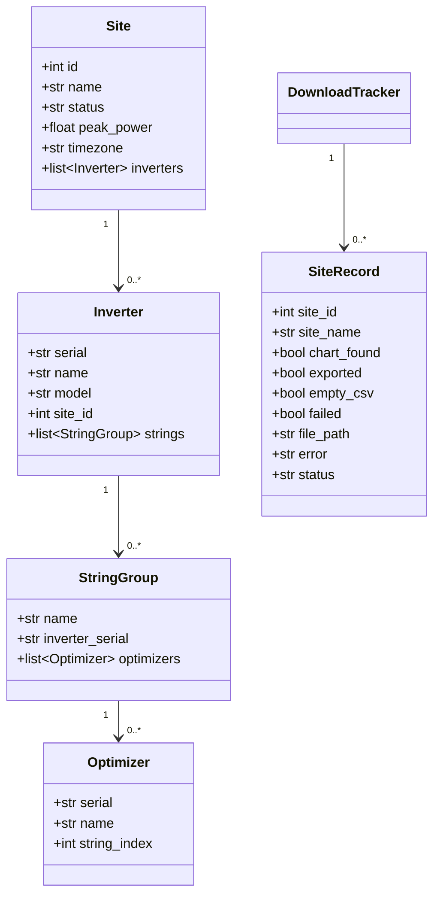

# SolarEdge Automation Tool

> Hybrid API + Playwright browser automation that downloads daily CSV energy data from the SolarEdge Monitoring Platform for an entire site fleet — automatically, every day, with zero manual clicking.

---

## Overview

The SolarEdge web portal exposes a rich Analytics UI but offers no bulk CSV export API. Fleet operators managing dozens or hundreds of sites must otherwise visit each site's Analytics panel individually and click Export for every chart.

This tool eliminates that entirely. It combines:

- **SolarEdge REST API** — for structured data (site list, inverter inventory, energy totals, telemetry)
- **Playwright browser automation** — for navigating the Analytics UI and downloading Saved Charts as CSVs

The result: two CSVs per site per day, plus a consolidated API data CSV, produced automatically with a single command.

---

## Features

| Feature | Description |
|---|---|
| Hybrid API + Browser | Each layer does what it does best; API for structured data, browser for UI-gated exports |
| Persistent login | Chrome profile stores your session; only one manual login ever needed |
| Multi-chart support | Downloads `ProdEnergy` (Day resolution) and `InverterProdPower` (5-min resolution) per site |
| Graceful degradation | Missing charts produce empty placeholder CSVs; failed sites don't stop the run |
| API details CSV | Consolidated site + inverter + telemetry data written from API calls |
| Structured logging | Rich colour console, plain-text log, JSONL log, and run-summary CSV |
| CLI flexibility | Single-site mode, dry-run mode, custom date override |
| Retry with back-off | API calls retry up to 3× with exponential delay on transient failures |

---

## Architecture



### Execution sequence



---

## Directory Structure

```
project_root/
├── main.py                # Entry point; orchestrates the full run
├── api_client.py          # All SolarEdge REST API calls
├── browser.py             # Playwright browser context manager + helpers
├── processor.py           # Per-site browser automation logic
├── tracker.py             # Download outcome tracking + summary table
├── logger.py              # Structured logging (console + .log + .jsonl)
├── models.py              # Typed dataclasses: Site, Inverter, StringGroup, Optimizer
├── config.py              # .env loading + directory creation
├── utils.py               # retry() decorator, date helpers, path helpers
├── discover_selectors.py  # Dev helper for finding updated CSS selectors
├── .env.example           # Template for environment variables
├── .env                   # Your credentials (never commit this)
├── downloads/
│   └── YYYY-MM-DD/
│       ├── api_deets_<date>.csv
│       ├── <SiteName>_ProdEnergy_<date>.csv
│       └── <SiteName>_InverterProdPower_<date>.csv
└── logs/
    ├── <run_id>.log
    ├── <run_id>.jsonl
    └── <run_id>_summary.csv
```

---

## Installation

### Prerequisites

- Python 3.10+
- A SolarEdge installer API key
- A SolarEdge monitoring account (for first-time browser login)

### Steps

```bash
# 1. Clone the repository
git clone <repo-url> && cd <repo-name>

# 2. Create and activate a virtual environment
python -m venv .venv
source .venv/bin/activate       # Linux/macOS
# .venv\Scripts\activate        # Windows

# 3. Install Python dependencies
pip install requests python-dotenv playwright rich

# 4. Install the Playwright Chromium browser
playwright install chromium

# 5. Set up your environment file
cp .env.example .env
# Edit .env and fill in SE_API_KEY at minimum
```

---

## Configuration

All settings live in `.env`. Copy `.env.example` to get started.

| Variable | Required | Default | Description |
|---|---|---|---|
| `SE_API_KEY` | **Yes** | — | SolarEdge installer API key |
| `SE_API_BASE` | No | `https://monitoringapi.solaredge.com` | API base URL |
| `SE_GROUP_NAME` | No | `STS Installed` | Client-side site group filter |
| `SE_PROFILE_DIR` | No | `~/.solaredge-browser-profile` | Persistent Chrome profile directory |
| `SE_HEADLESS` | No | `false` | `true` for server/CI (no display) |
| `SE_SLOW_MO` | No | `300` | ms delay between browser actions |
| `SE_MAX_RETRIES` | No | `3` | API retry limit |
| `SE_DOWNLOAD_DIR` | No | `./downloads` | Root directory for downloaded CSVs |

---

## Usage

### Normal run — all sites, previous day's data

```bash
python main.py
```

### Process a single site (for testing)

```bash
python main.py --site-id 12345
```

### Dry run — API enumeration only, no browser

```bash
python main.py --dry-run
```

### Override the export date

```bash
python main.py --date 2026-06-01
```

### Combine flags

```bash
python main.py --dry-run --site-id 12345
python main.py --date 2026-06-01 --site-id 12345
```

### First-time login

On the very first run (or after a session expiry), Chrome opens the SolarEdge login page:

1. Log in manually in the browser window.
2. Press **Enter** in the terminal.
3. The session is saved in `SE_PROFILE_DIR` for all future runs.

---

## Workflow



---

## APIs Used

### Authentication

All calls append `?api_key=<SE_API_KEY>` as a query parameter via `requests.Session.params`.

### Endpoints

| Endpoint | Method | Fields Extracted |
|---|---|---|
| `/sites/list` | GET | `id`, `name`, `status`, `peakPower` — paginated (100/page) |
| `/site/{id}/details` | GET | `location.timeZone` → site timezone |
| `/site/{id}/inventory` | GET | `inverters[].SN/name/model`, `optimizers[].SN/connectedTo/stringId` |
| `/site/{id}/overview` | GET | `lastDayData.energy`, `currentPower.power`, `alertQuantity` |
| `/site/{id}/energy` | GET | `energy.values[].value` for previous day (Wh → kWh) |
| `/equipment/{siteId}/{serial}/data` | GET | `L1/L2/L3Data.activePower`, `dcVoltage`, `inverterMode`, timestamp |

### Retry behaviour

API calls use the `@retry` decorator (3 attempts, 1.5s base delay, exponential back-off) for transient `requests.RequestException` errors.

---

## Output Files

### Chart CSVs — `downloads/YYYY-MM-DD/`

| File Pattern | Chart | Resolution |
|---|---|---|
| `<SiteName>_ProdEnergy_<date>.csv` | ProdEnergy | Day |
| `<SiteName>_InverterProdPower_<date>.csv` | InverterProdPower | 5 minutes |

> Site names have `,`, `/`, and `\` stripped/replaced for filesystem safety.
> Empty (zero-byte) placeholder files are written when a chart is not found.

### API Details CSV — `downloads/YYYY-MM-DD/api_deets_<date>.csv`

18-column file with one row per inverter per site:

```
site_id, site_name, site_status, peak_power, alert_count, site_timezone,
installed_capacity, energy_today_kwh, current_site_power_kw,
energy_yesterday_kwh, inverter_name, inverter_serial,
inverter_inventory_status, connected_optimizers, inverter_ac_power_kw,
inverter_dc_voltage, inverter_mode, telemetry_timestamp
```

---

## Logging

Three outputs per run, all in `logs/`:

| File | Format | Contents |
|---|---|---|
| `<run_id>.log` | Plain text with timestamps | Human-readable progress + errors |
| `<run_id>.jsonl` | JSON Lines | One structured object per site result |
| `<run_id>_summary.csv` | CSV | Machine-readable outcome per site: EXPORTED / EMPTY_CSV / FAILED / SKIPPED |

### Example JSONL record

```json
{
  "timestamp": "2026-06-08T09:15:32.001Z",
  "run_id": "run_2026-06-08T09-00-00",
  "site_id": 12345,
  "site_name": "Greenfield Primary School",
  "status": "EXPORTED",
  "chart_found": true,
  "exported": true,
  "empty_csv": false,
  "failed": false,
  "file_path": "/downloads/2026-06-07/Greenfield Primary School_ProdEnergy_2026-06-07.csv",
  "error": ""
}
```

### Final console summary

After every run a Rich table is printed to the terminal:

```
Site ID  │ Site Name                │ Chart    │ Status    │ File / Error
─────────┼──────────────────────────┼──────────┼───────────┼─────────────
12345    │ Greenfield Primary School │ ✓ found  │ EXPORTED  │ /downloads/…
67890    │ Riverside Community Solar │ ✗ missing│ EMPTY_CSV │ /downloads/…
11111    │ Hilltop Farm              │ ✓ found  │ FAILED    │ Timeout …

Total: 3 sites — 1 exported  1 missing chart (empty CSV)  1 failed
```

---

## Troubleshooting

| Problem | Likely Cause | Fix |
|---|---|---|
| `EnvironmentError: Missing SE_API_KEY` | `.env` missing or key not set | Copy `.env.example` → `.env`, add your key |
| Site not found with `--site-id` | Wrong ID or group filter excludes it | Run `--dry-run` to list discovered sites |
| `'Saved Charts' tab did not appear` | Selector changed after UI update | Run `discover_selectors.py`, update `processor.py` |
| Download timeout (60 s) | Slow network or very large dataset | Increase `_DOWNLOAD_TIMEOUT` in `processor.py` |
| Login prompt on every run | Profile dir missing or not writable | Verify `SE_PROFILE_DIR` in `.env` |
| All sites produce empty CSVs | Saved Charts not configured in portal | Check Analytics > Saved Charts in SolarEdge UI |
| Group filter has no effect | API group field name differs in your account | Uncomment and adjust the filter in `api_client.get_all_sites()` |

---

## Development Guide

### Adding a new chart to download

```python
# processor.py
CHART_NAMES = [
    "ProdEnergy",
    "InverterProdPower",
    "YourNewChart",        # ← add here
]

# In _do_export(), add resolution selection:
elif chart_name == "YourNewChart":
    resolution_box.click()
    page.get_by_role("option", name="15 minutes", exact=True).click()
```

### Updating selectors after a SolarEdge UI change

```bash
# Opens Chrome with Playwright Inspector — click any element to see its selector
python discover_selectors.py
```

Then update the `SEL_*` constants at the top of `processor.py`.

### Adding a new API field to `api_deets`

1. Add the field name to the `fieldnames` list in `_write_api_deets_csv()` in `main.py`.
2. Fetch and assign the value in the appropriate `try/except` block.
3. Test: `python main.py --dry-run` verifies API calls, then `--site-id` tests the CSV output.

### Running tests / validation

```bash
# Verify API connectivity and site enumeration without touching the browser
python main.py --dry-run

# Test browser automation on a single known-good site
python main.py --site-id 12345

# Test with a historical date
python main.py --site-id 12345 --date 2026-06-01
```

### Dependency updates

```bash
pip install --upgrade requests python-dotenv playwright rich
playwright install chromium   # always re-run after playwright upgrade
```

After any Playwright upgrade, verify selectors against a live site.

---

## Future Improvements

| Improvement | Description |
|---|---|
| Server-side group filter | Use SolarEdge API `searchText` param once it reliably supports group names, eliminating client-side filtering overhead |
| Scheduled execution | Wrap with cron / Windows Task Scheduler or a systemd service for fully unattended daily runs |
| Email / Slack alerts | Post a summary message after each run with FAILED site counts |
| Parallel site processing | Run multiple browser contexts concurrently (requires careful session isolation) |
| Database sink | Stream `api_deets` rows directly to a database instead of (or alongside) CSV |
| Selector self-healing | Detect selector failures and attempt auto-discovery via heuristics before raising |
| Docker container | Package with Playwright + Chromium for reproducible, dependency-free deployment |
| Re-try FAILED sites | A second pass after the main loop to retry only the sites that failed on the first attempt |

---

## Data Model



---

## License

Could not be determined from the provided code. Add a `LICENSE` file to the repository root.